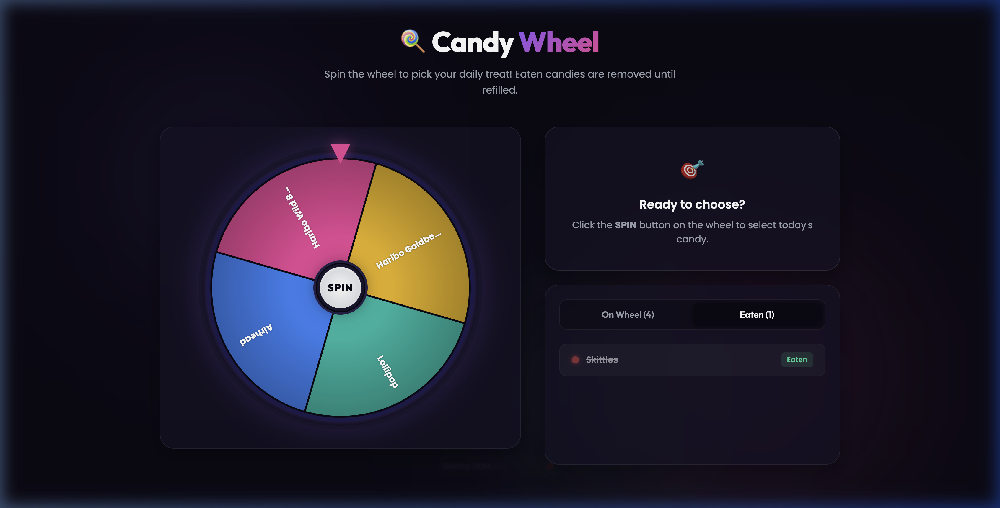

# Candy Wheel 🍭

A premium, interactive web application to select a candy from your daily stock, track what you've eaten, and filter out consumed treats. Perfect for portion control or just adding some playfulness to your daily sweet treats!



## ✨ Features

*   **Interactive Wheel**: High-DPI canvas-rendered wheel with vibrant colors, text along segments, and smooth physics decelaration.
*   **Audio Synthesis**: Real-time tick sounds when segments pass the pointer and chord chimes when winning, created using browser Web Audio API (no external asset dependencies).
*   **Stock Management**:
    *   **Add Candy**: Easily insert custom candy names into the stock.
    *   **Manual Eat**: Click to mark a candy as eaten instantly without spinning.
    *   **Delete**: Permanently delete any candy from your lists.
    *   **Undo**: Put eaten candies back onto the wheel with one click.
*   **Aesthetics**: Glassmorphic layout card panels with glowing borders and ambient moving backdrop orbs.
*   **Persistence**: Uses browser `localStorage` to keep track of stock and selection history across reloads.

## 🚀 Getting Started

To run the application locally:

1.  Clone the repository:
    ```bash
    git clone https://github.com/hminooei/candy-wheel.git
    cd candy-wheel
    ```

2.  Start a static file server. For example, using Node's `serve`:
    ```bash
    npx serve -l 3000
    ```
    Or Python's built-in server:
    ```bash
    python3 -m http.server 3000
    ```

3.  Open your browser and navigate to **`http://localhost:3000`**.

## 📄 License

Distributed under the MIT License. See [LICENSE](LICENSE) for more information.

